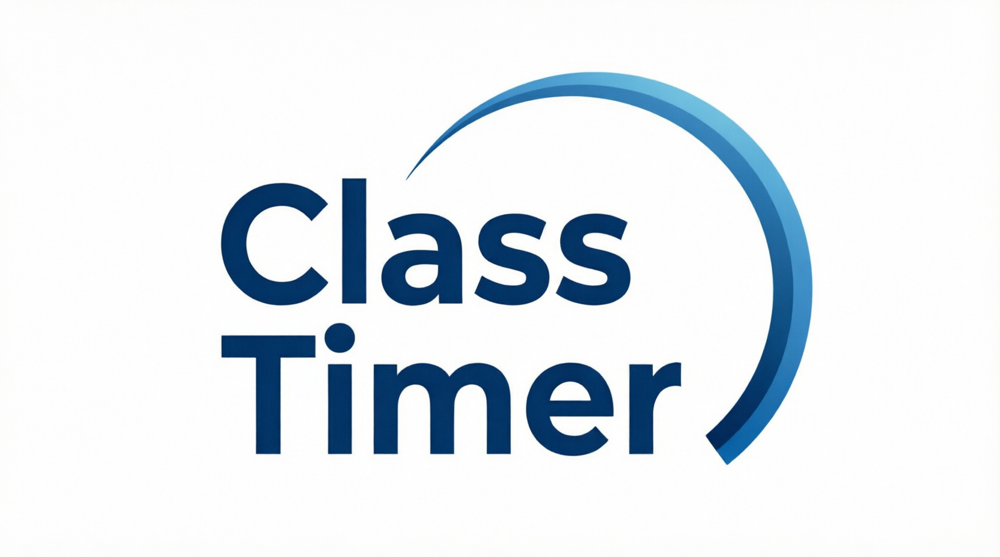
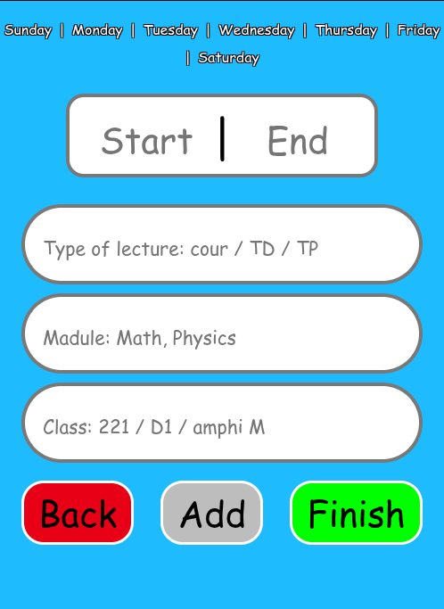
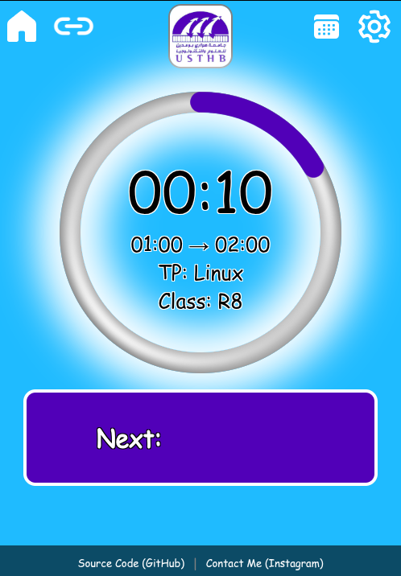

# 🌀 ClassTimer

<p align="center">
  
</p>

<p align="center">
  A simple Progressive Web App (PWA) that helps students track the remaining time of each lecture in real time.
</p>

<p align="center">
  <a href="https://ismailkechroud.github.io/ClassTimer/">🚀 Live Demo</a>
</p>

---

## 📖 About

**ClassTimer** is a lightweight web application designed to help students quickly know how much time is left before the end of their current class or lecture.

The app provides a clean and distraction-free interface, making it easy to stay aware of lecture timing throughout the school day.

---

## ✨ Features

* ⏱️ Real-time lecture countdown
* 📱 Responsive design for mobile and desktop
* 🌐 Progressive Web App (PWA)
* ⚡ Fast and lightweight
* 🎯 Simple and intuitive user experience
* 🔄 Works directly in the browser

---

## 🛠️ Built With

* HTML5
* CSS3
* JavaScript (Vanilla JS)
* Progressive Web App (PWA)

---

## 📸 Screenshots

### Home Screen



### Active Lecture Timer



---

## 🚀 Live Demo

Visit the application here:

**https://ismailkechroud.github.io/ClassTimer/**


---

## 🔧 Installation

Clone the repository:

```bash
git clone https://github.com/ismailkechroud/ClassTimer.git
```

Open the project folder and run it using your preferred local server.

---

## 🤝 Contributing

Contributions are welcome!

1. Fork the repository
2. Make your changes
3. Commit your updates
4. Submit a Pull Request

---

## 👨‍💻 Author

**Ismail Kechroud**

GitHub: https://github.com/ismailkechroud

---

## 📄 License

This project is open source and available under the MIT License.
